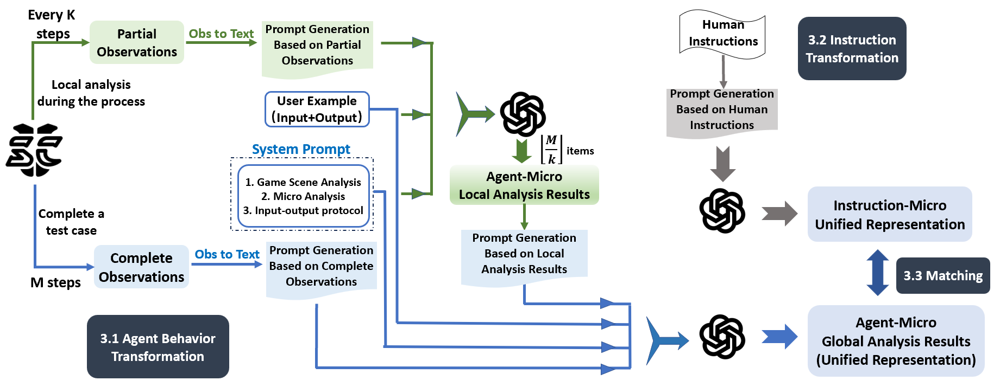

**Do Agents Behave Aligned with Human Instructions? - An Automated Assessment Approach**

We have proposed an automatic assessment approach *ABIM* (Agent Behavior Instruction Matching) for determining whether the agents behave aligned with human instructions based on LLM inference. 

 Overview of *ABIM* :

